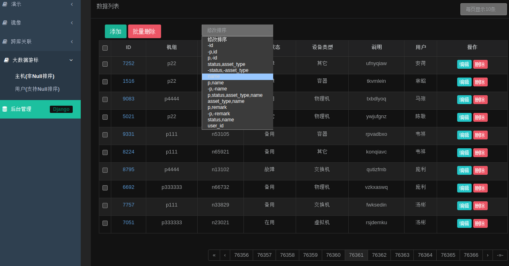

# django-views-templates 示例

django-low-code 低代码演示, 项目 https://github.com/py2010/django-generic-views-templates

相关APP模块(apps/generic)很适合放入自己项目中用于增强django功能, 本示例也很适合中级py人员向高级进阶/学习.

* 功能:

        django通用视图/模板演示
        示例模板使用的 inspinia_admin-v2.7 可自行换成和自己网站风格一致的模板,(apps/generic/templates/generic/*.html)
        1. 通用视图模板
        2. 列表页分页/查询/SQL优化
        3. 列表页字段链支持虚拟关联 (虚拟外键/o2o/m2m, 无需自定义模板和View), 多表关联SQL拆分成单表查询, 全自动优化!
        4. 可使用自动路由, urls/views/templates全自动处理
        5. 大数据游标分页, 比如当表数据百万/上亿时, 为了SQL性能, 使django支持游标分页, 支持配置小范围游标偏移,
           可按业务需求支持多字段排序, 业务排序字段数据可重, 排序字段可支持null数据, 自动唯一序列--游标精确偏移一丝不差!

* app:

        apps/generic/  # 框架app, django-views-templates项目APP
        apps/a/        # 业务app, 常用功能演示 (数据库: default)
        apps/mirror/   # 业务app, 零代码演示, 全自动生成 http://127.0.0.1:808/mirror/各models页-增删改查/
        apps/vr/       # 业务app, 虚拟外键/多对多演示, 分布式跨库join查询, 多表跨库全自动关联 (数据库: vr, default)
        apps/b/        # 业务app, 大数据游标分页示例, 默认数据很少, 请使用manage命令增加数据. (数据库: b)

* 环境：

        linux (目录c中的脚本为.sh, 如果是windows需手工runserver)
        python3.6 (字符串基本是使用f'{var}')
        django2.2 (兼容django 1.11, 经测试django3和4也都使用正常)

* 部署：

        # python3, 安装依赖库:
        pip3 install django==2.2.20
        pip3 install PyYAML==5.1
        pip3 install django-bootstrap3==11.1.0

        # 拉取代码
        git clone https://github.com/py2010/example
        或国内 git clone https://gitee.com/py2010/example

        # 进入目录, 运行django - runserver
        cd example
        # 启动
        c/d
        # (或者执行 python3 manage.py runserver 0.0.0.0:808)

        # 访问网站
        http://127.0.0.1:808
        使用账号/密码都是"demo"进行登录
        # 后端搜索过滤 - 常规示例
        http://127.0.0.1:808/a/m/?s=t3
        # 后端搜索过滤 - ORM示例
        # 因为ORM业务太杂暂时没有前端FORM表单自动化, 请根据自身业务自定义model模板扩展FORM,
        # 比如模型M列表页: apps/a/templates/a/m_list.html
        http://127.0.0.1:808/a/m/?t__name__icontains=t3
        http://127.0.0.1:808/a/m/?t__p__name__icontains=111

        # 大数据游标分页, 前端页排序可以自己选择
        (如果不是唯一序列, 最后序列会自动再按主键或unique=True的字段排序)
        http://127.0.0.1:808/b/host/?ordering=-p,id
        http://127.0.0.1:808/b/host/?ordering=p,-id
        http://127.0.0.1:808/b/host/?ordering=-p,status,asset_type,name
        http://127.0.0.1:808/b/user/?ordering=p,sex,name

* 常规功能演示图

* 跨库关联 - 演示图

* 大数据游标分页 - 演示图

* 大数据游标分页

        数据库big.sqlite3只有少量数据, 因为配置的偏移范围较小, 用于程序功能准确性测试, 检验锚点偏移取数是否正确.
        如果想测试SQL性能效果, 需要增加大量数据才好测试SQL性能, 数据多了可适当将偏移值设大, 便于大步进翻页.
        已做好命令脚本, 可以执行 c/d data 或 python3 manage data增加数据, 表User会有随机null数据用于测试空排序.
        c/d data -h (查看命令帮助信息, 或 python3 manage data -h)
        c/d data 10000     (表Host和表User各增加一万条数据)
        c/d data u 5000000 (表User增加五百万条数据)
        c/d data h 100000  (表Host增加十万条数据)
        游标功能程序位于 apps/generic/views/pagination.py 文件, CursorPaginator为游标分页器,
        NullFieldCursorPaginator 增加了null排序支持, 只支持各数据库默认的null排序,
        比如mysql的规则null最小, PG规则null最大,
        NULLS_FIRST = {
            'mssql': True,
            'mysql': True,
            'sqlite': True,
            'postgre': False,
            'oracle': False,
        }
        django可统一手工指定null最小或最大, 目前游标分页暂不支持手工统一指定null排序,
        开发当时计划是一起作出来, 过程中股神佩落西作妖, 精力分散后面就不想搞得太复杂了,
        因为这种需求我基本没碰到过, 比较冷门没必要, 脱离场景自己去各种兼容测试也很繁琐,
        且不像网站界面所见所得, SQL面向底层开发很不直观, 排错时游标定位偏差, 一堆苦力活.
        所以还是把常见功能先弄出来再说, 复杂需求大家自行研究.

        目前基于表Host和表User, 我详细测试了下各字段排序效果, 游标定位非常精确一丝不差!
        大数据时SQL性能优秀, 如果使用django原生分页, 翻到后面尤其是尾页就非常慢,
        因为普通分页翻页时, SQL都是从第一页开头进行超大范围OFFSET, 效率极差.
        而游标分页都是在前一次打开的页面数据基础上进行小范围OFFSET, 不用再从头开始, SQL很快.

* 二次开发(django-views-templates)

        将 apps/generic/ 整合入自己网站时, 如果网站前端不是inspinia_admin,
        需将 apps/generic/templates/generic/*.html 几个文件改成自己网站的组织/风格.
        对于py程序, 不像我们平时开发的业务代码, 低代码的程序一般比较精练, 和框架代码接近,
        建议在对django官方框架比较熟悉后, 才好方便二次开发, 尤其是虚拟关联功能,
        大家如果对django官方框架model/field注册初始化流程比较熟悉, 也很容易理解相应代码.
        大多数功能如model/field借用官方原有功能再稍做调整, 如果熟悉django则很容易改,
        否则对于新手, 问来问去周期长, 还不如自定义View/模板, 使用笨方法体力活, cv解决更快.

        大家使用过程中有什么问题, 功能新增/修改提出来, 如果是比较通用常见的功能,
        我可以考虑开发新增. 不常见的/市场小的, 开发起来动力不足.

* 其它

        所有演示功能对应的主体程序都在 apps/generic/ 目录,
        去年开发model表虚拟关联功能时, 当时打算表关系配置在View中, 但感觉不实用,
        且不同的View重复配置, 所以只是临时增加自定义模板方式实现, 没动力深入研究.

        最近捡起来重新研究了下, 虚拟关联功能改用modle.VirtualRelation配置表关系,
        相关功能尽量在django原有功能基础上新增, 和官方处理逻辑保持一致, 省了很多事.
        不用再自定义模板, 配置好VirtualRelation关系后无需自定义视图, 完全自动处理.

        开发时方案千万种, 所以有些地方来回反复修改过, 代码中有很多注释历史痕迹, 目前先这样,
        待以后使用过程中对各种需求, 适应场景等了解更清楚后, 再来确定最优方案和组织方式.
