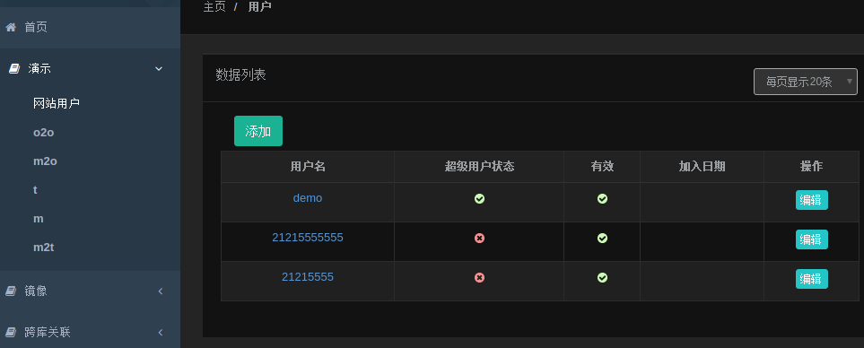
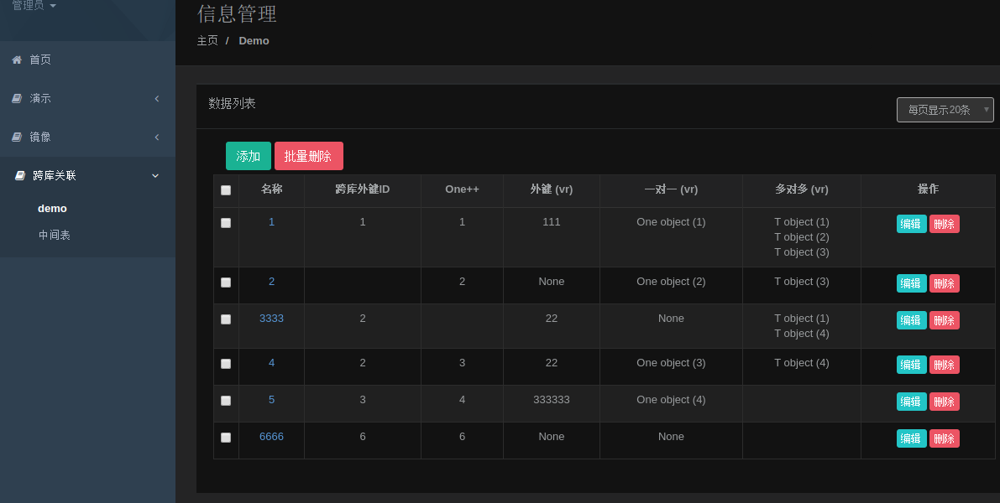

# django-views-templates 示例

django-low-code 低代码演示, 项目 https://github.com/py2010/django-generic-views-templates

相关APP模块很适合放入自己项目中用于增强django功能, 本示例也很适合中级py人员向高级进阶/学习.

* 功能:

        django通用视图/模板演示
        示例模板使用的 inspinia_admin-v2.7 大家可自行换成自己的模板.
        1. 通用视图模板
        2. 列表页分页/查询/SQL优化
        3. 列表页字段链支持虚拟关联 (虚拟外键/o2o/m2m, 无需自定义模板和View), 多表关联SQL拆分成单表查询, 全自动优化!
        4. 可使用自动路由, urls/views/templates全自动处理

* app:

        apps/generic/  # 框架app, django-views-templates项目APP
        apps/a/        # 业务app, 常用功能演示 (数据库: default)
        apps/mirror/   # 业务app, 零代码演示, 全自动生成 http://127.0.0.1:808/mirror/各models页-增删改查/
        apps/vr/       # 业务app, 虚拟外键/多对多演示, 分布式跨库join查询, 多表跨库全自动关联 (数据库: vr, default)

* 环境：

        linux (目录c中的脚本为.sh, 如果是windows需手工runserver)
        python3.6 (字符串基本是使用f'{var}')
        django2.2 (django 1.11估计也支持, 没详细测试)

* 部署：

        # python3, 安装依赖库:
        pip3 install django==2.2.20
        pip3 install PyYAML==5.1
        pip3 install django-bootstrap3==11.1.0

        # 拉取代码
        git clone https://github.com/py2010/example
        或国内 git clone https://gitee.com/py2010/example

        # 进入目录, 运行django - runserver
        cd example
        # 启动
        c/d
        # (或者执行 python3 manage.py runserver 0.0.0.0:808)

        # 访问网站
        http://127.0.0.1:808
        使用账号/密码都是"demo"进行登录
        # 后端搜索过滤 - 常规示例
        http://127.0.0.1:808/a/m/?s=t3
        # 后端搜索过滤 - ORM示例 (因为ORM业务太杂暂时没有前端FORM表单自动化, 请根据自身业务自定义model模板扩展FORM)
        http://127.0.0.1:808/a/m/?t__name__icontains=t3
        http://127.0.0.1:808/a/m/?t__p__name__icontains=111

* 常规功能演示图

* 跨库关联 - 演示图

* 其它

        所有演示功能对应的主体程序都在 apps/generic/ 目录,
        去年开发model表虚拟关联功能时, 当时打算表关系配置在View中, 但感觉不实用,
        且不同的View重复配置, 所以只是临时增加自定义模板方式实现, 没动力深入研究.

        最近捡起来重新研究了下, 虚拟关联功能改用modle.VirtualRelation配置表关系,
        相关功能尽量在django原有功能基础上新增, 和官方处理逻辑保持一致, 省了很多事.
        不用再自定义模板, 配置好VirtualRelation关系后无需自定义视图, 完全自动处理.

        开发时方案千万种, 所以有些地方来回反复修改过, 代码中有很多注释历史痕迹, 目前先这样,
        待以后使用过程中对各种需求, 适应场景等了解更清楚后, 再来确定最优方案和组织方式.

* 二次开发(django-views-templates)

        不像我们平时开发的业务代码, 低代码的程序一般比较精练, 和框架代码接近,
        建议在对django官方框架比较熟悉后, 才好方便二次开发, 尤其是虚拟关联功能,
        大家如果对django官方框架model/field注册初始化流程比较熟悉, 也很容易理解相应代码.
        大多数功能如model/field借用官方原有功能再稍做调整, 如果熟悉django则很容易改,
        否则对于新手, 问来问去周期长, 还不如自定义View/模板, 使用笨方法体力活, cv解决更快.

        大家使用过程中有什么问题, 功能新增/修改提出来, 如果是比较通用常见的功能,
        我可以考虑开发新增. 不常见的/市场小的, 开发起来动力不足.

